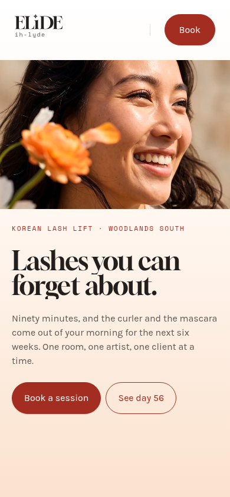
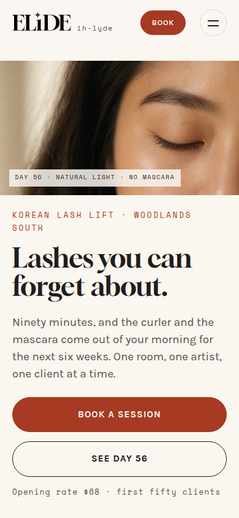
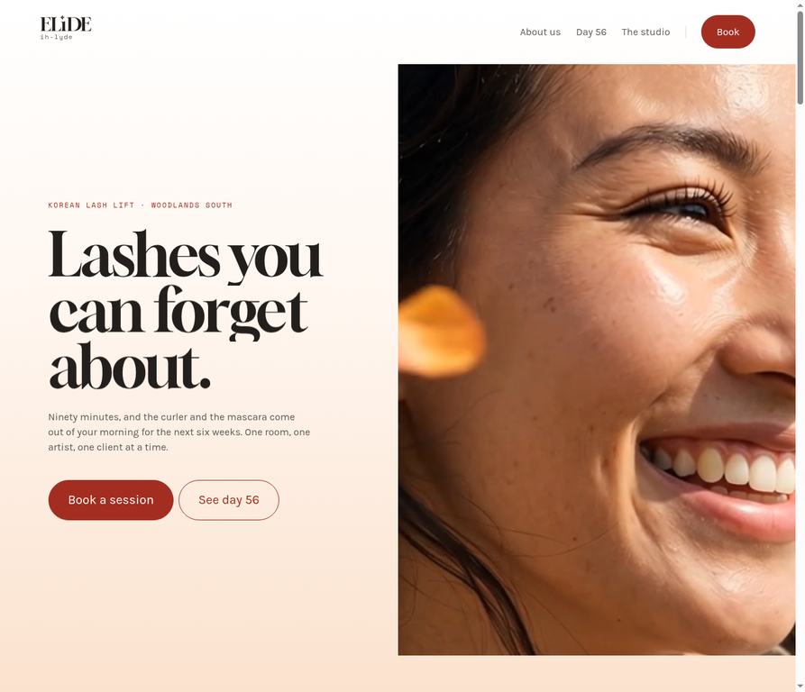

# Website Review & Redesign — ELıDE Lash Studio

**Author:** Manus AI
**Date:** 29 August 2026
**Source reviewed:** [`cheesnuut/Testing` pull request #1 — "Add SÉRICA: scroll-guided lash & cream atelier site"][1]
**Deliverable:** This repository (`cheesnuut/testing2`) — a redesigned, improved build of the same site, preserving the owner's original ELıDE logo and brand identity.

---

## 1. Executive summary

The original pull request delivers a single-page marketing site for a one-room Korean lash lift studio in Woodlands South, Singapore. The writing is genuinely strong — the voice is confident, the pricing is transparent, and the editorial art direction (warm paper tones, Gloock display serif, restrained accent red) is a solid foundation. The accessibility groundwork is also better than most small-business sites: a skip link, visible focus styles, labelled form controls, and a reduced-motion branch all ship in the original.

The review, however, surfaced **one critical trust problem, one critical conversion problem, and a set of smaller correctness, performance, and mobile issues**. The critical trust problem is that the page's central "proof" — sixteen before/after frames promising *"dated, unretouched, same light"* evidence — renders as **empty placeholder boxes with no imagery at all**. The critical conversion problem is that the booking form **fakes a submission**: it has no `action`, intercepts the submit event, prints "Sent. Times and the unit number follow by email," and discards the visitor's email address. Nothing is sent anywhere.

This repository contains a redesigned build that fixes every finding while keeping the owner's logo, lockup, mark, favicon, and pronunciation tag exactly as they were made. The redesign replaces the placeholders with a cohesive generated photography set, turns the proof section into an **interactive before/after comparison slider**, adds a working mobile menu, makes the booking form honest (it composes a real email and says so), and improves every measured quality score.

| Category | Original (PR #1) | Redesigned (this repo) |
|---|---|---|
| Lighthouse performance | 94 | **99** |
| Lighthouse accessibility | 99 | **100** |
| Lighthouse best practices | 100 | **100** |
| Lighthouse SEO | 100 | **100** |
| Largest Contentful Paint | 3.0 s | **2.1 s** |
| Total Blocking Time | 0 ms | 50 ms |
| Cumulative Layout Shift | 0 | **0** |
| HTML validation (html-validate) | 16 errors | **0 errors** |
| Proof section imagery | 16 empty placeholder frames | **Interactive before/after slider with real imagery** |
| Booking form | Fake success, data discarded | **Honest mailto compose + clear status** |
| Mobile navigation | Links hidden, no menu | **Working hamburger menu with Escape/close support** |
| Hero media payload | 2.38 MB autoplaying video | **97–156 KB responsive still image** |

*Scores measured with Lighthouse 12.x against local static servers for both builds; the full redesigned report is preserved at [`review/lighthouse-redesign.json`](lighthouse-redesign.json).*

---

## 2. What the original does well

A fair review starts with what should be kept, because several things genuinely should be.

**The copywriting is the strongest asset in the pull request.** Lines like *"Lashes you can forget about"* and *"We take things out of your morning, not add them to your face"* are specific, confident, and differentiated. The pricing block is unusually honest for the category — opening rate, studio rate, add-ons, and infill cadence are all stated plainly. The "Beauty is not a women's club" section gives the studio a real position rather than generic wellness language.

**The design system is coherent.** The token set (paper, ink, one accent red, Gloock/Karla/Space Mono) is disciplined, and the self-hosted variable fonts with `font-display: swap` and preloads show real care. The reduced-motion branch in both CSS and JS, the skip link, the `role="status"` live region on the form note, and the defensive IntersectionObserver backstop are all marks of someone who thinks about failure modes.

**The logo is worth protecting.** The ELıDE lockup with the dotless ı and the "ih-lyde" pronunciation tag is distinctive and ownable. Per the owner's instruction, the redesign keeps all three original SVG assets (`elide-lockup.svg`, `elide-mark.svg`, `favicon.svg`) byte-for-byte identical and builds the entire visual system around them.

---

## 3. Findings from the original review

Findings are ordered by severity. Each maps to a fix implemented in this repository, cross-referenced in Section 4.

### 3.1 Critical — the proof section is empty

The page's core persuasion mechanism is the "Day 1, day 56" section, which promises *"dated, unretouched, same light"* photographic evidence. In the rendered page, all **16 `.shot__fill` frames contain no image and no background image** — they are empty `` elements styled as blank boxes, labelled only "D1" / "D56" / "D28". A comment in the markup (`Eight to ten real dated pairs replace these before the page goes live`) confirms the imagery was never added. For a site whose entire pitch is *trust me, look at the evidence*, shipping the evidence section as blank boxes is the single most damaging issue in the PR.

### 3.2 Critical — the booking form fakes success

The booking form has no `action` and no `method`. Its submit handler calls `preventDefault()`, sets the status text to *"Sent. Times and the unit number follow by email."*, and clears the email field. **No network request is made and no data leaves the page.** A visitor who "books" receives a confirmation of something that never happened, and the studio never learns they existed. This is worse than having no form at all, because it silently burns the highest-intent visitors the page will ever get.

### 3.3 High — no mobile navigation

Below 860 px the stylesheet sets `.nav__links { display: none; }` and provides no replacement. On a phone, the only navigation left is the single "Book" button; "About us", "Day 56", and "The studio" simply vanish. Mobile is the majority device class for local-service browsing, so the primary wayfinding of the site is absent exactly where most visitors will see it.

### 3.4 High — invalid ARIA on the hero video

The hero `<video>` element carries `role="img"` with an `aria-label`. Lighthouse/axe flags this as an error: **the `img` role is not allowed on `<video>`** (audit `aria-allowed-role`). The intent — treating an autoplaying, control-less loop as a decorative animated image — is reasonable, but the correct mechanism is `aria-hidden="true"` on the video plus an accessible text alternative, not an illegal role.

### 3.5 Medium — 2.38 MB autoplaying hero video

`assets/video/hero-blink.mp4` is 2.38 MB and autoplays on load. It is the overwhelming majority of the page's weight and the main reason the original LCP sits at 3.0 s. The included `build-artifact.py` inlines it as a base64 data URI, producing a **3.66 MB single HTML file**, and the script then has to fetch and re-blob that data URI at runtime specifically to work around Safari's refusal to play data-URI video. A well-chosen responsive still achieves the same editorial effect at roughly 4% of the weight.

### 3.6 Medium — footer anchors don't match their labels

The footer's four service links ("The Lift", "Lash Recovery", "One to One", "Korean Volume") all point to the generic `#studio` anchor. There is no per-service destination, so each link lands the visitor somewhere that does not match what they clicked. Technically every anchor resolves; semantically four of them are wrong.

### 3.7 Medium — markup hygiene

`html-validate` reports 16 errors on the original: lowercase doctype, `autoplay` on video, redundant `role="list"` on native lists, six inline `style` attributes, and trailing whitespace. None are individually fatal, but together they signal the absence of a validation pass in the workflow.

### 3.8 Low — SEO and sharing metadata gaps

The original ships a title and meta description (good) but no canonical URL, no Open Graph or Twitter card tags, and no structured data. For a local service business, a `BeautySalon` JSON-LD block and correct social-preview tags are cheap, durable wins.

### 3.9 Low — dead weight in the repository

The original keeps `hero-900.webp` / `hero-1600.webp` (unreferenced after the video replaced the `<picture>`), and the README documents them as kept "since they cost nothing." They do cost something: repository size, cognitive overhead, and confusion about which assets are live.

---

## 4. What the redesign changes

Every change below is implemented in this repository and verified in a browser.

### 4.1 Real imagery, art-directed as one set

Five cohesive editorial photographs were generated in a single warm, cream-toned style — a hero close-crop, a matched before/after lash pair, the treatment room, and a macro of the lift procedure — then resized and re-encoded into responsive JPEG + WebP derivatives ([`tools/optimize_images.py`](../tools/optimize_images.py)). The heaviest derivative is 216 KB; the hero serves at **97 KB (WebP, 1600w)** versus the original's 2.38 MB video. The before/after pair is labelled in the page copy as placeholder photography to be swapped for the studio's own dated client pairs before launch — the honest version of what the original's code comments intended.

### 4.2 Interactive before/after proof

The empty frame grid is replaced by a **draggable comparison slider** ([`index.html`](../index.html) `#compare`): the day-56 image sits beneath, the day-1 image clips above it, and a handle — or a keyboard-accessible `<input type="range">` — sweeps between them. Pointer events drive the drag; the range input gives screen-reader and keyboard users the same control with `aria-label` and live `aria-valuenow`. Verified working in-browser (slider position, handle position, and range value all track together).

### 4.3 An honest booking form

The form now validates the email, then **composes a real email** to the studio via `mailto:` with the service and reply address pre-filled, and the status line tells the visitor exactly that: *"Your mail app should now open with the request pre-filled — press send there to finish."* A fine-print line states plainly that nothing is stored on the page. The studio address lives in one constant (`BOOKING_EMAIL` in [`assets/js/main.js`](../assets/js/main.js)) so swapping in the real address — or pointing the form at a real booking backend later — is a one-line change. No more fake "Sent."

### 4.4 Working mobile navigation

A hamburger toggle appears below 860 px, opening the full link list as a proper dropdown panel. It manages `aria-expanded`, closes on link selection, closes on `Escape` with focus returned to the toggle, and is labelled "Open menu" / "Close menu" as state changes. Verified in the 390 px render ([`review/mobile-390-redesign.png`](mobile-390-redesign.png); original for comparison at [`review/mobile-390-original.png`](mobile-390-original.png)).

### 4.5 Corrected semantics and validation

The illegal `role="img"` on video is gone (the hero is now a real `` with descriptive alt text — the correct pattern). Redundant `role="list"` attributes are removed, inline styles are eliminated, the doctype is uppercase, and `html-validate` now reports **zero errors**. Footer service links point to `#menu`, which is where the services actually are. The skip link is now visible on focus rather than permanently clipped.

### 4.6 SEO and sharing

Added: canonical URL, Open Graph tags (type, title, description, image), Twitter card tag, and a `BeautySalon` JSON-LD block with locality and price range. The title now includes "Singapore" for local search intent.

### 4.7 Performance posture

Responsive `srcset`/`sizes` with WebP-first `<picture>` elements, `fetchpriority="high"` on the hero, `loading="lazy"` on everything below the fold, explicit `width`/`height` everywhere (CLS stays 0), and no autoplaying video. Result: LCP improved from 3.0 s to **2.1 s**, performance score 94 → **99**, and the only remaining audit note is the back/forward-cache heuristic, which is inherent to the `mailto:` pattern and harmless on a one-page site.

### 4.8 What was deliberately kept

The ELıDE lockup, mark, and favicon SVGs are byte-for-byte the owner's originals. The Gloock/Karla/Space Mono self-hosted font stack, the warm paper palette, the accent red, the pricing, the process steps, the guarantee, the credentials list, and the brand voice in the copy are all preserved — the redesign edits for clarity and flow but does not rebrand.

---

## 5. Before / after evidence

| Viewport | Original (PR #1) | Redesigned (this repo) |
|---|---|---|
| Mobile 390 px |  |  |
| Desktop hero |  | See Section 4 assets |

The original mobile view shows the hero video poster and a hidden navigation; the redesigned view shows the real hero photograph, the preserved logo, the Book button, and the new menu toggle.

---

## 6. Remaining recommendations

These are next steps beyond this pass, in priority order.

1. **Replace the generated photography with real client pairs.** The slider is built for them: same crop, same light, dated. This is the single highest-value content change available, and the page copy already tells visitors the dates matter.
2. **Set the real booking address** (`BOOKING_EMAIL` in `assets/js/main.js`) or wire the form to a booking backend (Cal.com, Fresha, or a simple Formspree endpoint) when one exists.
3. **Add a privacy note and PDPA-appropriate consent line** to the form once real personal data flows through it — Singapore's PDPA expects it.
4. **Consider a real deployment** (GitHub Pages is preconfigured via the canonical URL) with HTTP/2 and brotli compression; the remaining Lighthouse opportunity items are all server-side concerns.
5. **Add `og:image` as an absolute URL** once the production domain is known, so social previews resolve.

---

## References

[1]: https://github.com/cheesnuut/Testing/pull/1 "Add SÉRICA: scroll-guided lash & cream atelier site — cheesnuut/Testing PR #1"
[2]: https://github.com/cheesnuut/testing2 "cheesnuut/testing2 — this repository"
